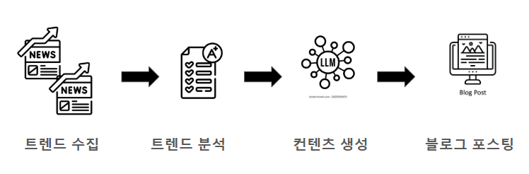

# 수익형 블로그 자동화


### 고도화
- [ ] 주제 중복 제거하기
- [ ] 트렌드 파악을 위한 크롤링한 데이터 파이프라인 만들기
- [ ] 블로그 갯수 늘리기
- [ ] 크롤링 개선
- [ ] SEO 최적화
- [ ] 포스트 생성 비용 최적화
- [ ] 광고 외 수익화 방법 마련
- [ ] 블로그 광고 붙이기
- [ ] google analytics


### How TO GET STARTED


### 동작 구조


- 깃 푸쉬 시, hook에 설정된 `post-push` 스크립트를 실행. ssh로 로컬 서버에 코드 복사 후 scheduling 실행.

### 비용
- trend parsing
    gnews: 하루에 요청 100개 제한
- content generation
    openai: 2000토큰이면 0.01달러정도 씀
- 요청 한번에 쌓이는 데이터양
- 도메인 구매 비용(1년계약) 12달러(=17,670원)

### 데이터
- 한 번의 요청에 생성되는 데이터
```
data/trends/trends_{job_id}.json
data/contents/contents_{job_id}.json
data/results/publishing_results_{job_id}.json
data/metadata/job_{job_id}.json
```

여기서 `job_id`는 각 작업마다 고유하게 생성되는 식별자로, 타임스탬프와 고유 해시로 구성됩니다. 
예시: `20230524_112233_a1b2c3d4`

- **메타데이터 관리**: 모든 작업은 `data/metadata/` 디렉토리에 메타데이터 파일을 생성합니다. 이 파일에는 작업 ID, 시작 시간, 상태, 관련 파일 경로 등의 정보가 포함됩니다.

- **작업 추적**: 각 작업의 모든 데이터 파일에는 동일한 job_id가 포함되어 있어, 하나의 요청으로 생성된 모든 파일을 쉽게 추적할 수 있습니다.

- **특정 작업 데이터 사용**: 다음 명령으로 특정 작업 ID의 데이터를 사용할 수 있습니다.
```bash
python main.py --mode=content --job-id=20230524_112233_a1b2c3d4
```


- **데이터 용량**: 한 번의 요청에 생성되는 데이터 파일의 평균 크기는 다음과 같습니다:
  - **트렌드 데이터 (trends)**: 약 2KB - 뉴스 기사 메타데이터 및 기본 분석 정보
  - **콘텐츠 데이터 (contents)**: 약 5-11KB - 생성된 블로그 콘텐츠, 마크다운 형식
  - **게시 결과 데이터 (results)**: 약 0.5KB - 게시 상태 및 URL 정보
  - **메타데이터 (metadata)**: 약 0.2KB - 작업 상태 및 파일 경로 정보
  - **총 데이터 용량**: 약 8-14KB / 요청

- **데이터 증가 예측**:
  - 일일 1회 실행: 약 8-14KB / 일
  - 주 7회 실행: 약 56-98KB / 주
  - 월 30회 실행: 약 240-420KB / 월
  - 연간: 약 2.9-5.1MB / 년

- **실제 대규모 배포 시 고려사항**:
  - 다수의 블로그 운영 시: N개 블로그 × 데이터 용량
  - 복수 언어 지원 시: L개 언어 × 데이터 용량
  - 생성 콘텐츠 크기 확장 시: 콘텐츠 데이터 용량 증가


### 모니터링

AutoBlog는 Grafana, Loki, Prometheus를 사용한 포괄적인 모니터링 시스템을 제공합니다.

#### 모니터링 시스템 설정

1. **Docker 설치**: 모니터링 시스템은 Docker 기반으로 구축되어 있습니다. [Docker](https://docs.docker.com/get-docker/)와 [Docker Compose](https://docs.docker.com/compose/install/)를 먼저 설치하세요.

2. **모니터링 시스템 시작**:
```bash
# 모니터링 컨테이너 시작
docker-compose -f docker-compose-monitoring.yml up -d

# 메트릭 익스포터 시작
python run_monitoring.py
```

3. **대시보드 접속**: http://localhost:3000 으로 접속 (기본 계정: admin/autoblog)

#### 모니터링 내용

1. **시스템 상태**:
   - 시스템 업타임 및 상태
   - 총 작업 수 및 성공/실패율
   - 데이터 저장소 크기

2. **비용 모니터링**:
   - 다양한 LLM 서비스별 토큰 사용량 및 예상 비용
   - 다음 LLM 서비스 지원: OpenAI, Anthropic, Google, Cohere, Mistral AI, 기타 커스텀 서비스
   - 서비스별 비용 비율 분석을 통한 비용 최적화 지원
   - 뉴스 API 요청 횟수 및 제한 사용량

3. **성능 모니터링**:
   - 콘텐츠 생성 시간
   - 게시 처리 시간
   - 트렌드 분석 시간

4. **데이터 모니터링**:
   - 데이터 유형별 크기 추이
   - 작업 메타데이터 분석
   - 로그 집계 및 검색


### 요구사항
- 포스팅을 자동으로 하는 블로그를 운영한다.
- 수익화를 위해 방문율이 높은 포스트를 올린다.
- 포스트는 LLM 기반으로 자동 작성한다.
- 링크 클릭이나 광고 게재를 통해 수익을 얻는다.


### 기술적 요구사항
- 블로그 선택. 여러 블로그들을 운영한다. 같은 포스팅을 올린다. 스케쥴링
- 방문율이 높은 포스트 -> 실시간 트렌드를 파악한다(크롤링)
- 방문율과 광고 수익, 그리고 운영비용을 체크할 수 있어야한다.
- 운영비용은 LLM을 돌리기 위한 금액, 서버 운영 비용


### 주의사항
- 거짓정보x
- 운영비용이 수익보다 크면 안됨


### 구현
- 블로그 생성
- 블로그 포스팅 자동화
- 크롤링을 통한 트렌드 파악
- 포스트 생성
- 광고 게재(구글/네이버/카카오)


### 구조
```
autoblog/
│
├── src/                          # 소스 코드
│   ├── __init__.py
│   │
│   ├── core/                     # 핵심 기능
│   │   ├── __init__.py
│   │   ├── interfaces.py         # 모든 추상 인터페이스 정의
│   │   └── system.py             # 메인 시스템 클래스
│   │
│   ├── storage/                  # 데이터 저장소 구현
│   │   ├── __init__.py
│   │   └── json_storage.py       # JSON 파일 기반 데이터 저장소
│   │
│   ├── trends/                   # 트렌드 파악 모듈
│   │   ├── __init__.py
│   │   ├── parsers/              # 다양한 트렌드 파서 구현
│   │   │   ├── __init__.py
│   │   │   ├── news_parser.py    # 뉴스 기반 트렌드 파서
│   │   │   ├── social_parser.py  # 소셜 미디어 트렌드 파서
│   │   │   └── search_parser.py  # 검색어 트렌드 파서
│   │   └── analyzers/            # 트렌드 분석 도구
│   │       ├── __init__.py
│   │       └── trend_analyzer.py
│   │
│   ├── content/                  # 콘텐츠 생성 모듈
│   │   ├── __init__.py
│   │   ├── generators/           # 다양한 콘텐츠 생성기 구현
│   │   │   ├── __init__.py
│   │   │   ├── openai_generator.py
│   │   │   └── claude_generator.py
│   │   ├── formatters/           # 콘텐츠 포맷팅
│   │   │   ├── __init__.py
│   │   │   └── markdown_formatter.py
│   │   └── templates/            # 프롬프트 템플릿
│   │       ├── __init__.py
│   │       └── blog_templates.py
│   │
│   ├── publishing/               # 포스트 게시 모듈
│   │   ├── __init__.py
│   │   ├── platforms/            # 다양한 블로그 플랫폼 구현
│   │   │   ├── __init__.py
│   │   │   ├── wordpress.py
│   │   │   ├── tistory.py
│   │   │   ├── medium.py
│   │   │   └── github_pages.py
│   │   └── monetization/         # 수익화 관련 코드
│   │       ├── __init__.py
│   │       ├── google_adsense.py
│   │       └── affiliate_links.py
│   │
│   ├── analytics/                # 분석 모듈
│   │   ├── __init__.py
│   │   ├── trackers/             # 다양한 분석 추적기
│   │   │   ├── __init__.py
│   │   │   └── performance_tracker.py
│   │   └── reporters/            # 리포팅 도구
│   │       ├── __init__.py
│   │       └── roi_calculator.py
│   │
│   └── utils/                    # 유틸리티 기능
│       ├── __init__.py
│       ├── config.py             # 설정 관리
│       ├── logger.py             # 로깅
│       └── scheduler.py          # 스케줄링
│
├── config/                       # 설정 파일
│   ├── default.yml               # 기본 설정
│   ├── platforms.yml             # 플랫폼별 설정
│   └── secrets.yml               # API 키 등 민감 정보 (gitignore에 추가)
│
├── data/                         # 데이터 저장
│   ├── trends/                   # 수집된 트렌드 데이터
│   ├── contents/                 # 생성된 콘텐츠 데이터
│   ├── results/                  # 게시 결과 데이터
│   ├── metadata/                 # 작업 메타데이터
│   └── analytics/                # 분석 데이터
│
├── tests/                        # 테스트 코드
│   ├── __init__.py
│   ├── test_trends.py
│   ├── test_content.py
│   ├── test_publishing.py
│   └── test_analytics.py
|
├── scripts/                      # 유틸리티 스크립트
│   ├── setup.sh                  # 초기 설정 스크립트
│   └── run_scheduled.py          # 스케줄러 실행
│
├── main.py                       # 메인 실행 파일
├── scheduler.py                  # 자동화 스케줄러
├── requirements.txt              # 의존성 목록
└── README.md                     # 프로젝트 설명
```

### 주요 기능

- **작업 ID 기반 파일 관리**: 모든 데이터 파일은 고유한 작업 ID로 구분되어 관리됩니다.
- **메타데이터 관리**: 각 작업의 상태와 관련 파일 경로를 메타데이터로 관리합니다.
- **최신 작업 검색**: 가장 최근에 완료된 작업을 찾는 기능을 제공합니다.
- **추상화된 파일 I/O**: 파일 저장 및 로드 작업을 추상화하여 다양한 백엔드로 쉽게 교체할 수 있습니다.


## 스케줄러 사용법

AutoBlog는 자동 스케줄링 기능을 제공하여 정해진 시간에 블로그 콘텐츠를 자동으로 생성하고 게시할 수 있습니다.

### 기본 사용법

```bash
# 스케줄러 실행
python scheduler.py
```

스케줄러가 실행되면 다음과 같은 기능을 제공합니다:
- `config/default.yml`의 `publishing.docusaurus.schedule` 설정에 따라 자동으로 실행
- 기본 설정은 매일 오전 8시에 실행 (`0 8 * * *`)
- 스케줄러 실행 시 즉시 한 번 실행할지 여부를 선택할 수 있음
- Ctrl+C를 눌러 스케줄러를 종료할 수 있음

### 서비스로 등록하기

#### Linux (systemd)

1. `scripts/autoblog.service` 파일에서 다음 설정을 변경:
   - `User=<사용자명>` - 실행할 사용자 이름으로 변경
   - `WorkingDirectory=/path/to/AutoBlog` - 실제 프로젝트 경로로 변경

2. 서비스 설치 및 시작:
```bash
sudo cp scripts/autoblog.service /etc/systemd/system/
sudo systemctl daemon-reload
sudo systemctl enable autoblog
sudo systemctl start autoblog
```

3. 서비스 상태 확인:
```bash
sudo systemctl status autoblog
```

#### Windows

1. [NSSM (Non-Sucking Service Manager)](https://nssm.cc/download)을 다운로드하고 PATH에 추가

2. 관리자 권한으로 PowerShell 실행 후 서비스 설치:
```powershell
.\scripts\install_windows_service.ps1
```

3. 서비스 상태 확인:
```powershell
Get-Service -Name AutoBlogScheduler
```

### 스케줄 설정 변경

스케줄을 변경하려면 `config/default.yml` 파일의 `publishing.docusaurus.schedule` 값을 수정하세요.
cron 형식으로 설정합니다 (분 시 일 월 요일).

예시:
- `0 8 * * *`: 매일 오전 8시
- `0 */6 * * *`: 6시간마다 (0시, 6시, 12시, 18시)
- `0 9 * * 1-5`: 평일(월-금) 오전 9시
- `0 20 * * 0,6`: 주말(토,일) 저녁 8시